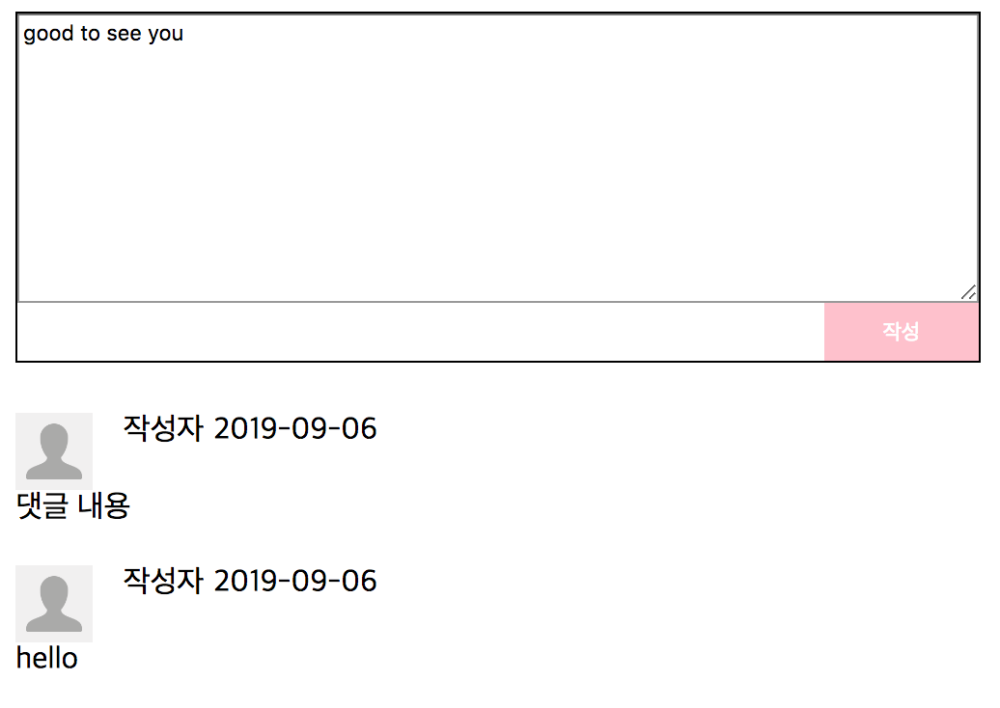

# comment form

## 문제

다음과 같은 댓글입력 폼을 만들어봅시다.

너비는 500px이고, 버튼 색은 마음대로 하시고 (사진은 pink), 사람 이미지는 아무거나 40x40 쓰시고, 대충 느낌가는대로 해봅시다. 버튼은 너비 80px 높이 30px.

어디 서버로 보내는 거 아니구요. 그냥 작성 버튼 누르면 화면에 나타나게 하면 돼요. 댓글 내용은 날짜를 나타낼 필요없으니 2019-09-06 이라고 그냥 적어도 됩니다. 사진 다 빼고 댓글 내용만 들어가도 됩니다.

완전 똑같이는 저도 못 해서 새로 만들었으니까 아래 최소 조건만 만족해봅시다.

### 난이도

많이 어려움

### 최소 조건

* 작성 버튼을 눌렀을 때, 입력한 내용으로 댓글 리스트에 댓글이 작성된다.
* 폼을 작성할 때 form tag를 사용한다.
* 작성버튼이 오른쪽으로 가있으면 좋겠다.
* 작성버튼과 댓글입력하는 부분과 둘을 감싸는 테두리가 빈틈이 없었으면 좋겠다.

### 더 하고 싶은 사람

정답에서 하지 않은 부분을 다룹니다.

* 날짜를 현재 시각으로 넣기 (Date 공부)
* 댓글 적으면 내용 사라지게 (UX 편의)
* 왼쪽에 붙어있는 버튼과 작성 버튼 왼편에 붙어있는 버튼 만들기 (정답 코드에 있음)

## 힌트

[힌트](HINT.md)

## 정답

[정답](ANSWER.md)
