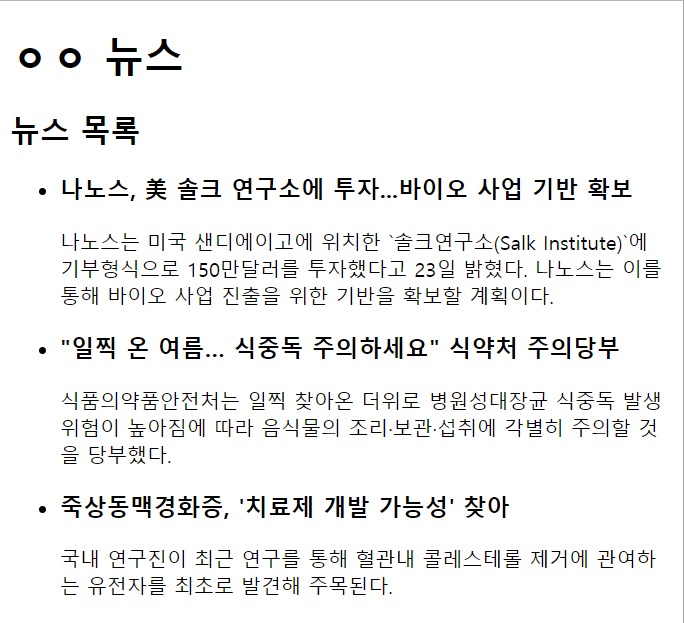

# news main page

## 문제

아래와 같이 뉴스의 메인 페이지를 꾸며봅시다.

윈도우10, 크롬66 환경이고 환경에 따라 모습의 차이가 있을 수 있으니 디테일은 신경 안 쓰셔도 되고 아래 최소 조건만 만족하세요.

자신만의 뉴스 서비스 제목을 정하고 씁시다.

기사 3개를 퍼왔습니다.

* [기사1 - 나노스, 美 솔크 연구소에 투자...바이오 사업 기반 확보](http://news.mk.co.kr/newsRead.php?sc=30000001&year=2018&no=326155)
* [기사2 - "일찍 온 여름… 식중독 주의하세요" 식약처 주의당부](http://www.hankookilbo.com/v/db89e43f469449e1ac376421466bf73e)
* [기사3 -죽상동맥경화증, '치료제 개발 가능성' 찾아 ](http://www.bosa.co.kr/news/articleView.html?idxno=2083902)

위 기사들에서 첫 문단과 제목을 복사해서 사용하세요.

좁은 이유는 인터넷 창을 좁혀서 그렇습니다.

**이 문제에는 정답이 없습니다.**

### 난이도

쉬움

### 최소 조건

* HTML5 에 추가된 semantic 태그들을 적극 활용해봅시다.

### 더 하고 싶은 사람

* 넣고 싶은 요소를 넣으세요. (기사 작성 시간
* 최신 뉴스 부분과 조회수 높은 뉴스 부분을 나눠봅시다.
* 내용의 의미가 드러나는 tag를 쓰세요

## 힌트

[힌트](HINT.md)

## 정답

[정답](ANSWER.md)
