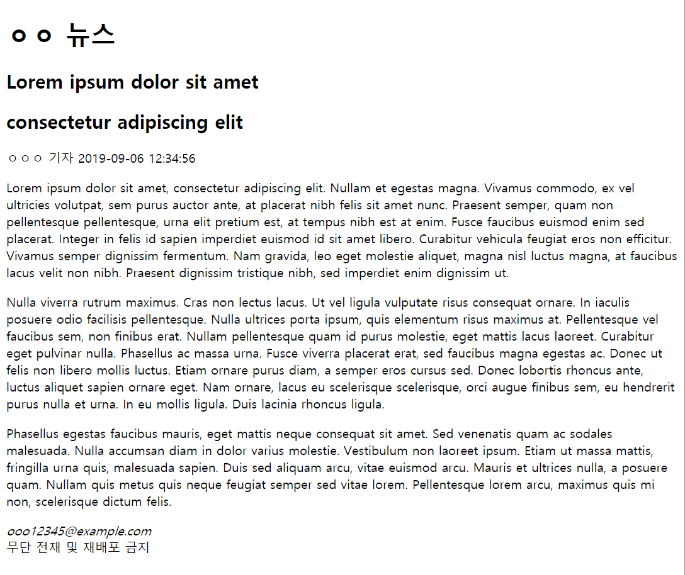

# news view page

## 문제

아래와 같이 뉴스 기사 전문이 나타나는 페이지를 작성합시다.

메인 페이지 문제에 올렸던 링크의 기사들을 복사해도 되는데,
그 기사들은 무단 전재 및 재배포 금지이니 복사할 경우 어디 자랑하지는 말고
자신의 컴퓨터에만 둡시다.

저는 Lorem ipsum dolor sit amet 을 쓰도록 하겠습니다. [여기](https://www.lipsum.com/feed/html)서 만들었습니다.

### 난이도

쉬움

### 최소 조건

* 저번 문제와 마찬가지로 semantic tag에 유의
* 기사 제목 (부제목이 있으면 부제목), 본문, 기사 작성 시간, 기자, 이메일 포함

## 힌트

없음

## 정답

코드를 보고 스스로 공부하자.
